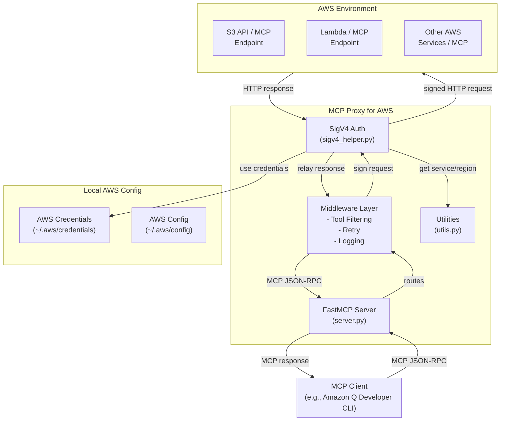
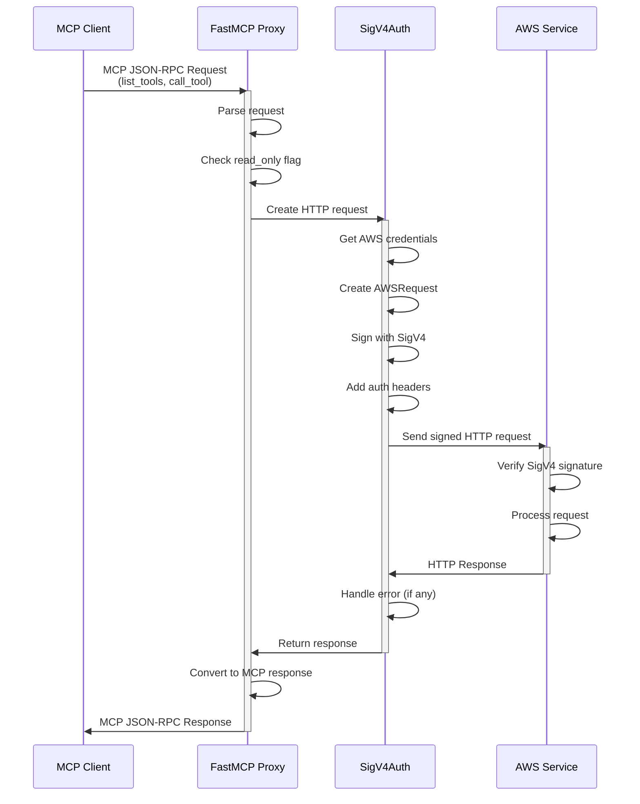
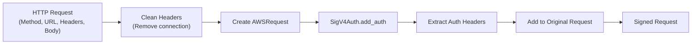
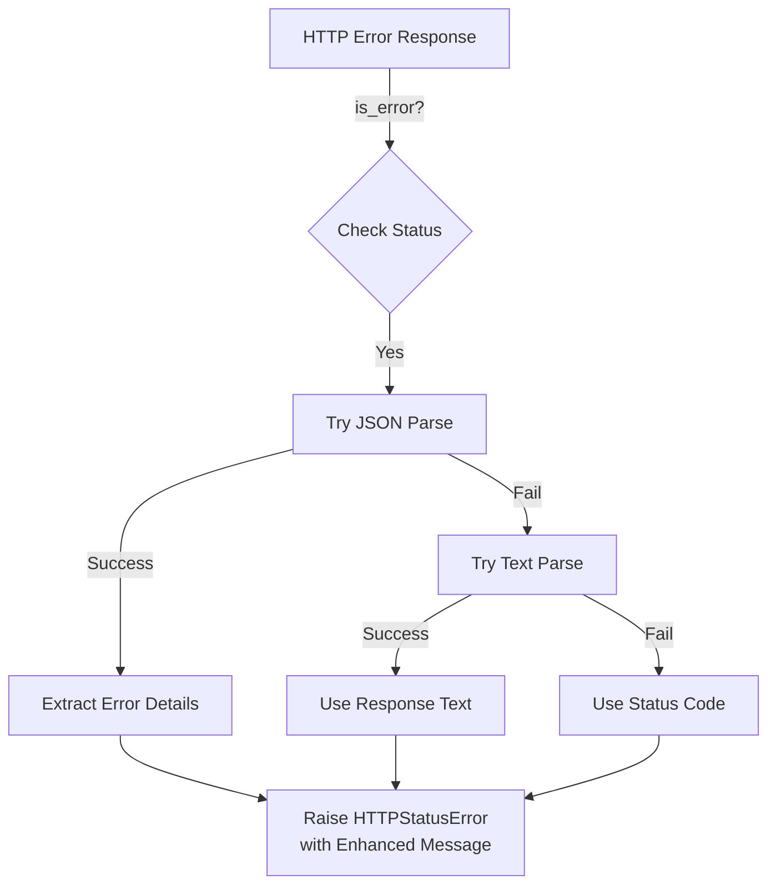

# MCP Proxy for AWS - 実装ガイド

MCP Proxy for AWS は、AWS SigV4 認証を使用してバックエンドの MCP サーバーと通信するクライアント側プロキシサーバーです。このドキュメントでは、プロジェクトのアーキテクチャと実装の詳細を説明します。

## はじめに：このツールが作られた背景と目的

### なぜこのツールが必要になったのか？

AWS は複数の MCP（Model Context Protocol）サーバーを公開しています。これらのサーバーは、AI アシスタント（Claude、Amazon Q など）が AWS リソースにアクセスするためのツールセットを提供します。しかし、以下の課題がありました：

1. **認証の複雑さ**
   - AWS MCP サーバーは AWS SigV4 認証で保護されている
   - クライアント側で SigV4 署名を管理・生成するのは非常に複雑
   - 複数のツールが独立して認証情報を扱う必要がある

2. **複雑なゲートウェイ設定**
   - API Gateway などを使用するには複雑なインフラ設定が必要
   - エンタープライズゲートウェイプラットフォームへの依存

3. **既存の AWS 認証情報の活用**
   - 開発者は既に `~/.aws/credentials` や IAM ロールなど AWS 認証情報を持っている
   - それらを簡単に再利用したい

### 解決策：MCP Proxy for AWS

このプロキシは、**ローカルで実行可能なシンプルなブリッジ** として設計されました：

```
┌─────────────────────┐
│  AI クライアント    │
│(Amazon Q, Claude等) │
└──────────┬──────────┘
           │ MCP JSON-RPC
           ↓
┌─────────────────────────────┐
│  MCP Proxy for AWS          │
│ (このツール)                │
│ - SigV4 署名生成            │
│ - ツール検出                │
│ - リトライ・ロギング        │
└──────────┬──────────────────┘
           │ SigV4署名済みリクエスト
           ↓
┌────────────────────────────────────┐
│  AWS MCP サーバー                  │
│ (EKS-MCP, Lambda-MCP など)         │
│ - SigV4 署名を検証                 │
│ - ツールを実行                     │
└────────────────────────────────────┘
```

### このツールでできること

1. **ローカルの AWS 認証情報を使用** - ~/.aws/credentials や IAM ロールを活用
2. **AWS MCP サーバーへのシンプルなアクセス** - 複雑な設定なし
3. **ツールのフィルタリング** - 読み取り専用モードで書き込み操作を制限
4. **自動リトライとロギング** - ネットワークエラーに対応、デバッグ情報を記録

### プロキシの主要な仕事（コア機能）

このツールの核となる3つの処理：

```
【ステップ 1】リクエスト受け取り
   AI クライアント
       ↓ MCP JSON-RPC
   「EKS クラスター一覧をください」

【ステップ 2】SigV4 署名生成
   ~/.aws/credentials から読み込み
       ↓
   ローカルの AWS 認証情報を使用
       ↓
   SigV4 署名を生成
       ↓
   リクエストに署名ヘッダーを追加

【ステップ 3】署名済みリクエストを送信
   Authorization: AWS4-HMAC-SHA256 Credential=...
   X-Amz-Date: 20231215T123456Z
       ↓ HTTPS
   AWS MCP サーバー
       ↓ (署名を検証) ✓
   「クラスター: cluster-1, cluster-2」
       ↓
   AI クライアントへ返す
```

### プロキシがないとどうなるのか？

もし直接 AI クライアントが AWS MCP サーバーにアクセスしようとしたら：

```
【シナリオ 1：プロキシがない場合】

┌──────────────────────────────────────┐
│  AI クライアント                     │
│  (Claude, Amazon Q など)           │
│                                      │
│  「EKS のクラスター一覧をください」  │
└──────────────────┬──────────────────┘
                   │ 普通の HTTP リクエスト
                   │ (署名なし)
                   ↓
┌──────────────────────────────────────┐
│  AWS MCP サーバー                    │
│  (SigV4 認証必須)                    │
│                                      │
│  ❌ エラー：                         │
│  「署名がありません」                │
│  「Authentication required」         │
│  「401 Unauthorized」                │
└──────────────────────────────────────┘

結果：アクセス不可。AWS リソースが使えない。
```

```
【シナリオ 2：プロキシがある場合】

┌──────────────────────────────────────┐
│  AI クライアント                     │
│  (Claude, Amazon Q など)           │
│                                      │
│  「EKS のクラスター一覧をください」  │
└──────────────────┬──────────────────┘
                   │ MCP JSON-RPC
                   ↓
┌──────────────────────────────────────┐
│  MCP Proxy for AWS                   │
│                                      │
│  ✓ ~/.aws/credentials 読み込み      │
│  ✓ SigV4 署名生成                    │
│  ✓ 署名付きリクエスト作成            │
└──────────────────┬──────────────────┘
                   │ SigV4 署名付き HTTPS
                   ↓
┌──────────────────────────────────────┐
│  AWS MCP サーバー                    │
│  (SigV4 認証検証)                    │
│                                      │
│  ✓ 署名検証成功                      │
│  ✓ リクエスト処理                    │
│  「クラスター: cluster-1, cluster-2」│
└──────────────────┬──────────────────┘
                   │ レスポンス
                   ↓
┌──────────────────────────────────────┐
│  AI クライアント                     │
│                                      │
│  「クラスター情報を取得できました！」│
└──────────────────────────────────────┘

結果：正常にアクセス可能。AWS リソースを操作できる。
```

### プロキシなしでアクセスする場合の課題

もし開発者が直接 AWS MCP サーバーにアクセスしようとすると、以下の問題が発生：

| 課題 | 説明 |
|------|------|
| **SigV4 署名の生成** | クライアント側で署名を生成する複雑な処理が必要 |
| **秘密鍵の管理** | AWS の秘密アクセスキーをクライアントに持たせる必要がある |
| **セキュリティ** | クライアント側で認証情報を直接扱うのは危険 |
| **複雑な設定** | 複数のツール・クライアントが各自で認証を実装 |
| **トラブルシューティング** | 署名エラーのデバッグが困難 |

**プロキシはこれらをすべて解決**：
- 署名生成を一元管理
- ローカル認証情報を安全に活用
- AI クライアント側は認証について考えなくていい
- 透過的に通信できる

## 概要

### プロジェクトの目的

- MCP クライアントと AWS ホストの MCP サーバー間をブリッジ
- AWS SigV4 認証の自動処理
- ツールの動的な検出と登録
- 読み取り専用モードでのツール実行制限

### 主要な特徴

- **SigV4 認証**: ローカルの AWS 認証情報を使用してリクエストに署名
- **プロキシ機能**: JSON-RPC ベースの MCP プロトコルをサポート
- **ミドルウェア**: ツールフィルタリング、リトライ、ロギング機能
- **設定可能**: CLI オプションでエンドポイント、プロファイル、リージョン、タイムアウト等を指定可能

## アーキテクチャ

### システム構成図



### リクエストフロー



## コンポーネント詳細

### 1. **server.py** - エントリーポイント

エントリーポイントであり、FastMCP サーバーのセットアップと実行を担当します。

#### 主要な関数

- **`main()`**: アプリケーションのエントリーポイント
  - CLI 引数を解析
  - ロギングを設定
  - FastMCP サーバーをセットアップして実行

- **`parse_args()`**: コマンドライン引数をパース
  - `endpoint`: バックエンド MCP サーバーの URL（必須）
  - `--service`: AWS サービス名（オプション、URL から推測可能）
  - `--region`: AWS リージョン（オプション）
  - `--profile`: AWS プロファイル（オプション）
  - `--read-only`: 読み取り専用モード
  - `--log-level`: ログレベル（DEBUG/INFO/WARNING/ERROR/CRITICAL）
  - `--retries`: リトライ回数
  - `--timeout`, `--connect-timeout`, `--read-timeout`, `--write-timeout`: タイムアウト設定

- **`setup_mcp_mode()`**: MCP プロキシモードのセットアップ
  - サービス名とリージョンを決定
  - SigV4 認証トランスポートを作成
  - プロキシ FastMCP インスタンスを設定
  - ミドルウェアを追加
  - サーバーを非同期で実行

#### ミドルウェア関連の関数

- **`add_logging_middleware()`**: デバッグロギングを有効にする
  - DEBUG レベルでペイロードを含めてログ出力

- **`add_retry_middleware()`**: 自動リトライを追加
  - 指定された回数まで失敗したリクエストを再試行

- **`add_tool_filtering_middleware()`**: ツールフィルタリングを追加
  - `--read-only` フラグが有効な場合、書き込み権限が必要なツールをフィルタリング

### 2. **sigv4_helper.py** - SigV4 認証

AWS SigV4 署名付きリクエストの作成と処理を担当します。

#### 主要なクラス

**`SigV4HTTPXAuth`** - httpx の auth フロー実装

```python
class SigV4HTTPXAuth(httpx.Auth):
    def auth_flow(self, request: httpx.Request) -> Generator[httpx.Request, httpx.Response, None]:
        # リクエストに SigV4 署名を追加
        # 1. ヘッダーをクリーンアップ
        # 2. AWSRequest オブジェクトを作成
        # 3. SigV4Auth で署名
        # 4. 署名ヘッダーを元のリクエストに追加
```

#### 主要な関数

- **`create_aws_session(profile=None)`**: AWS セッションを作成
  - プロファイル指定あれば適用
  - 認証情報が利用可能か確認

- **`create_sigv4_auth(service, region, profile=None)`**: SigV4 認証インスタンスを生成
  - AWS セッションから認証情報を取得
  - SigV4HTTPXAuth インスタンスを返す

- **`create_sigv4_client(service, region, timeout=None, profile=None, headers=None)`**: SigV4 認証付き httpx.AsyncClient を生成
  - StreamableHttpTransport と組み合わせて使用
  - デフォルトヘッダーを設定（Accept: application/json, text/event-stream）
  - エラーレスポンスハンドラーを登録

- **`_handle_error_response(response)`**: HTTP エラーレスポンスハンドラー
  - エラーレスポンスから詳細情報を抽出
  - JSON/Text/Status Code の順でエラーメッセージを構築
  - 拡張されたエラーメッセージで HTTPStatusError を発生

### 3. **utils.py** - ユーティリティ関数

ユーティリティ関数を提供します。

#### 主要な関数

- **`create_transport_with_sigv4(url, service, region, custom_timeout, profile)`**: SigV4 認証付きトランスポートを作成
  - クライアントファクトリを定義
  - StreamableHttpTransport でラップ
  - MCP との JSON-RPC 通信に使用

- **`determine_service_name(endpoint, service=None)`**: サービス名を決定
  - `service` パラメータが指定されていれば それを使用
  - URL のホスト名から推測（最初のドットまたはダッシュ前の部分）
  - 例：`eks-mcp.us-west-2.api.aws` → `eks-mcp`

- **`determine_aws_region(endpoint, region=None)`**: リージョンを決定
  - `region` パラメータが指定されていればそれを使用
  - URL から推測（`.region.api.aws` パターン）
  - 環境変数 `AWS_REGION` から取得
  - デフォルトとして `us-east-1` を使用（実装による）

- **`within_range(min_value, max_value=None)`**: argparse 用のレンジバリデータファクトリ
  - タイムアウト値などの数値検証に使用
  - 最小値・最大値チェック

### 4. **middleware/tool_filter.py** - ツールフィルタリング

ツール実行権限に基づくフィルタリングを実装します。

#### クラス：`ToolFilteringMiddleware`

```python
class ToolFilteringMiddleware(Middleware):
    async def on_list_tools(self, context, call_next):
        # ツール一覧を取得
        tools = await call_next(context)

        # read_only が有効でなければ全ツール返す
        if not self.read_only:
            return tools

        # read_only が有効な場合、readOnlyHint=True のツールのみ返す
        filtered_tools = []
        for tool in tools:
            if tool.annotations.readOnlyHint:
                filtered_tools.append(tool)

        return filtered_tools
```

**動作**：
- `on_list_tools` 時にツール一覧をフィルタリング
- `readOnlyHint` アノテーションが `True` のツールのみ通す
- 書き込み権限が必要なツールをスキップ

### 5. **logging_config.py** - ロギング設定

ロギング設定を一元管理します。

#### 関数：`configure_logging(level=None)`

```python
def configure_logging(level: Optional[str] = None) -> None:
    # ログフォーマット設定
    # コンソールハンドラーの設定
    # ルートロガーに適用
    # httpx/httpcore ノイズを抑制
```

**特徴**：
- 標準フォーマット: `%(asctime)s | %(levelname)s | %(name)s | %(message)s`
- stderr に出力
- デフォルトレベルは INFO
- httpx/httpcore は WARNING レベルに抑制

## 実行フロー（詳細）

### 1. アプリケーション起動

```
python -m mcp_proxy_for_aws <endpoint> [options]
```

### 2. 引数解析と検証

```python
args = parse_args()
# endpoint: https://eks-mcp.us-west-2.api.aws
# service: eks-mcp (推測可能)
# region: us-west-2 (推測可能)
# profile: default (オプション)
```

### 3. ロギング初期化

```python
configure_logging(args.log_level)  # ロギング設定
```

### 4. FastMCP サーバーセットアップ

```python
mcp = FastMCP(name='MCP Proxy')
```

### 5. MCP モード設定

```python
await setup_mcp_mode(mcp, args)
  ├─ サービス名決定
  ├─ リージョン決定
  ├─ AWS セッション作成
  ├─ SigV4 トランスポート作成
  ├─ FastMCP プロキシを作成
  ├─ ミドルウェアを追加
  │   ├─ ToolFilteringMiddleware (read_only 有効時)
  │   ├─ RetryMiddleware (retries > 0 時)
  │   └─ LoggingMiddleware (DEBUG 時)
  └─ async run_async()
```

### 6. 要求処理

MCP クライアントからのリクエスト → ミドルウェアチェーン → SigV4 署名 → AWS サービス → レスポンス

## 認証フロー

### SigV4 署名プロセス



**署名の対象**：
- HTTPメソッド
- URL パス
- クエリパラメータ
- ヘッダー（Content-Type, Host など）
- リクエストボディ

**追加されるヘッダー**：
```
Authorization: AWS4-HMAC-SHA256 Credential=..., SignedHeaders=..., Signature=...
X-Amz-Date: 20231215T123456Z
X-Amz-Security-Token: ...（一時認証情報の場合）
```

## 設定オプション

### CLI オプション一覧

| オプション | 型 | デフォルト | 説明 |
|-----------|-----|---------|------|
| `endpoint` | str | 必須 | MCP エンドポイント URL |
| `--service` | str | 推測 | AWS サービス名 |
| `--region` | str | 推測 | AWS リージョン |
| `--profile` | str | 環境変数 | AWS プロファイル |
| `--read-only` | bool | false | 読み取り専用モード |
| `--log-level` | str | INFO | ログレベル |
| `--retries` | int | 0 | リトライ回数 (0-10) |
| `--timeout` | float | 180.0 | 全体タイムアウト（秒） |
| `--connect-timeout` | float | 60.0 | 接続タイムアウト（秒） |
| `--read-timeout` | float | 120.0 | 読み取りタイムアウト（秒） |
| `--write-timeout` | float | 180.0 | 書き込みタイムアウト（秒） |

### 使用例

```bash
# 基本的な使用
mcp-proxy-for-aws https://eks-mcp.us-west-2.api.aws

# カスタムプロファイルと明示的なリージョン指定
mcp-proxy-for-aws https://eks-mcp.us-west-2.api.aws \
  --profile my-profile \
  --region us-west-2

# 読み取り専用モード、デバッグログ有効
mcp-proxy-for-aws https://eks-mcp.us-west-2.api.aws \
  --read-only \
  --log-level DEBUG

# リトライとタイムアウトカスタマイズ
mcp-proxy-for-aws https://eks-mcp.us-west-2.api.aws \
  --retries 3 \
  --timeout 300 \
  --connect-timeout 120
```

## 認証情報の解決順序

### AWS 認証情報

1. 環境変数（AWS_ACCESS_KEY_ID, AWS_SECRET_ACCESS_KEY）
2. IAM ロール（EC2 インスタンスメタデータサービス）
3. `~/.aws/credentials` ファイル
4. `~/.aws/config` ファイル

### AWS リージョン

1. `--region` CLI オプション
2. エンドポイント URL から推測（`.region.api.aws`）
3. `AWS_REGION` 環境変数
4. `~/.aws/config` のデフォルトリージョン

### AWS プロファイル

1. `--profile` CLI オプション
2. `AWS_PROFILE` 環境変数
3. `~/.aws/config` のデフォルトプロファイル

## エラーハンドリング

### エラーレスポンスの処理



### 再試行ロジック

RetryMiddleware による自動リトライ：
- リトライ可能なエラー：ネットワークエラー、5xx、一部の 429
- バックオフ戦略：指数関数的
- 最大リトライ回数：`--retries` で指定

## パフォーマンス考慮事項

### 接続プーリング

```python
httpx.Limits(
    max_keepalive_connections=1,  # 同時保持接続数
    max_connections=5,            # 最大接続数
)
```

**注意**：ボトルネックになる可能性あり。高トラフィック環境では調整が必要。

### タイムアウト設定

- **全体タイムアウト**: デフォルト 180 秒
- **接続タイムアウト**: デフォルト 60 秒
- **読み取りタイムアウト**: デフォルト 120 秒
- **書き込みタイムアウト**: デフォルト 180 秒

### ログレベルの影響

- **DEBUG**: ペイロード検査を含むため、オーバーヘッド大（開発環境推奨）
- **INFO**: 標準動作
- **WARNING 以上**: 最小オーバーヘッド

## テスト戦略

### ユニットテスト（`tests/unit/`）

- `test_server.py`: サーバー設定、引数解析
- `test_sigv4_helper.py`: SigV4 認証、クライアント作成
- `test_utils.py`: ユーティリティ関数
- `test_tool_filter.py`: ツールフィルタリングロジック

### 統合テスト（`tests/integ/`）

- テスト用 MCP サーバーとの統合テスト
- エンドツーエンドのツール実行検証
- リトライ、タイムアウト動作の検証

## 実際の使用方法

### ステップ 1：AWS 認証情報の準備

AWS MCP サーバーにアクセスするには、AWS 認証情報が必要です。以下のいずれかの方法で設定します：

#### 方法 A：AWS CLI で設定
```bash
aws configure
# 対話形式で AWS_ACCESS_KEY_ID, AWS_SECRET_ACCESS_KEY などを入力
```

#### 方法 B：環境変数で設定
```bash
export AWS_ACCESS_KEY_ID=<your-access-key>
export AWS_SECRET_ACCESS_KEY=<your-secret-key>
export AWS_REGION=us-east-1
```

#### 方法 C：~/.aws/credentials ファイルを直接編集
```ini
[default]
aws_access_key_id = <your-access-key>
aws_secret_access_key = <your-secret-key>
```

### ステップ 2：プロキシの起動

AWS MCP サーバーのエンドポイント URL を指定してプロキシを起動します：

```bash
# 基本的な使用方法
uv run mcp_proxy_for_aws/server.py https://eks-mcp.us-west-2.api.aws

# または、PyPI からインストール済みの場合
uvx mcp-proxy-for-aws@latest https://eks-mcp.us-west-2.api.aws
```

**エンドポイント URL の例：**
- `https://eks-mcp.us-west-2.api.aws` - EKS MCP サーバー
- `https://lambda-mcp.us-east-1.api.aws` - Lambda MCP サーバー
- その他の AWS MCP サーバー

### ステップ 3：AI クライアント側の設定

プロキシが起動したら、AI クライアント（Amazon Q Developer CLI など）から接続します。

#### Amazon Q Developer CLI の場合：

`~/.aws/amazonq/mcp.json` または `~/.cursor/mcp.json` に以下を追加：

```json
{
  "mcpServers": {
    "eks-mcp-proxy": {
      "disabled": false,
      "type": "stdio",
      "command": "uv",
      "args": [
        "--directory",
        "/path/to/mcp-proxy-for-aws",
        "run",
        "mcp_proxy_for_aws/server.py",
        "https://eks-mcp.us-west-2.api.aws",
        "--region",
        "us-west-2"
      ]
    }
  }
}
```

### ステップ 4：プロキシとクライアントの通信

1. **AI クライアント** → `list_tools()` でツール一覧をリクエスト
2. **プロキシ** → ローカル AWS 認証情報で SigV4 署名を生成
3. **プロキシ** → AWS MCP サーバーへ署名済みリクエストを送信
4. **AWS MCP サーバー** → SigV4 署名を検証、ツール一覧を返す
5. **プロキシ** → AI クライアントへツール一覧を返す
6. ユーザーが AI でツールを実行 → 上記 2-4 が繰り返される

### 実際の使用例

#### 例 1：基本的な設定

```bash
# プロキシ起動（EKS MCP サーバーに接続）
uv run mcp_proxy_for_aws/server.py https://eks-mcp.us-west-2.api.aws \
  --profile default \
  --region us-west-2 \
  --log-level INFO
```

AI クライアントから「EKS のクラスター一覧を取得」などのリクエストを送ると、プロキシが認証してサーバーに転送します。

#### 例 2：読み取り専用モード（安全な運用）

```bash
# 書き込み操作を禁止
uv run mcp_proxy_for_aws/server.py https://eks-mcp.us-west-2.api.aws \
  --read-only \
  --log-level INFO
```

このモードでは、削除や変更操作が UI から非表示になり、不意の変更を防げます。

#### 例 3：デバッグモード

```bash
# 詳細なログ出力（SigV4 署名プロセスなどを確認）
uv run mcp_proxy_for_aws/server.py https://eks-mcp.us-west-2.api.aws \
  --log-level DEBUG \
  --retries 3
```

#### 例 4：タイムアウト設定

```bash
# 長時間実行される操作向けのタイムアウト設定
uv run mcp_proxy_for_aws/server.py https://eks-mcp.us-west-2.api.aws \
  --timeout 300 \
  --connect-timeout 120 \
  --read-timeout 180
```

### よくある使用シナリオ

| シナリオ | 設定 | コマンド |
|--------|------|--------|
| 開発環境（フル権限） | デフォルト | `uv run server.py <endpoint>` |
| 本番環境（読み取り専用） | `--read-only` | `uv run server.py <endpoint> --read-only` |
| デバッグ時 | `--log-level DEBUG` | `uv run server.py <endpoint> --log-level DEBUG` |
| ネットワーク不安定 | `--retries 5` | `uv run server.py <endpoint> --retries 5` |
| 複数の AWS プロファイル | `--profile` | `uv run server.py <endpoint> --profile staging` |

## 今後の改善提案

1. **接続プール制限の調整**（カンフォーマブル化）
2. **入力検証の強化**（エンドポイント URL 検証）
3. **ヘッダー管理の改善**（SigV4 署名対象外ヘッダー）
4. **リージョン決定ロジックの拡張**（複数の AWS エンドポイントパターンに対応）
5. **型注釈の完全化**（すべての関数に型ヒント）

## 参考資料

- [AWS SigV4 Signing Process](https://docs.aws.amazon.com/general/latest/gr/signature-version-4.html)
- [Model Context Protocol (MCP)](https://modelcontextprotocol.io/)
- [FastMCP](https://docs.fastmcp.io/)
- [HTTPX Documentation](https://www.python-httpx.org/)
