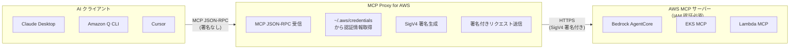

# MCP Proxy for AWS - 実装ガイド

## TL;DR

### このツールは何？

**MCP Proxy for AWS** は、AI アシスタント（Claude Desktop、Amazon Q Developer CLI など）から **IAM 認証で保護された AWS MCP サーバー** に接続するためのブリッジツールです。

#### SigV4 とは？

SigV4（Signature Version 4）は **AWS の IAM 認証方式** です。AWS API を呼び出す際、リクエストに「この人は正当な IAM ユーザー/ロールです」という署名を付けます。

```
SigV4 = IAM 認証の署名方式
      = Access Key + Secret Key + リクエスト内容 → 署名を生成
      = AWS が「誰からのリクエストか」を検証する仕組み
```

AWS の MCP サーバー（Bedrock AgentCore、EKS MCP など）は IAM 認証（SigV4）で保護されていますが、一般的な MCP クライアントは SigV4 署名に対応していません。このツールがその間を取り持ち、ローカルの AWS 認証情報（`~/.aws/credentials` や IAM ロール）を使って自動的に署名を行います。



### 2 つの使い方

| 使い方 | 説明 | 対象ユーザー |
|--------|------|-------------|
| **プロキシとして** | ローカルでプロキシサーバーを起動し、MCP クライアントと AWS MCP サーバーを接続 | Claude Desktop、Amazon Q Developer CLI ユーザー |
| **ライブラリとして** | Python コードから直接 AWS MCP サーバーに接続 | LangChain、LlamaIndex、Strands Agents 開発者 |

### ユースケース

#### ユースケース 1：Claude Desktop から AWS MCP サーバーを使う

```json
// ~/.cursor/mcp.json または Claude Desktop の設定
{
  "mcpServers": {
    "eks-mcp": {
      "command": "uvx",
      "args": ["mcp-proxy-for-aws@latest", "https://eks-mcp.us-west-2.api.aws"]
    }
  }
}
```

これで Claude Desktop から「EKS クラスター一覧を見せて」などのリクエストが可能に。

#### ユースケース 2：Amazon Q Developer CLI から AWS MCP サーバーを使う

```json
// ~/.aws/amazonq/mcp.json
{
  "mcpServers": {
    "bedrock-agentcore": {
      "command": "uvx",
      "args": [
        "mcp-proxy-for-aws@latest",
        "https://runtime.bedrock-agentcore.us-east-1.amazonaws.com/mcp",
        "--region", "us-east-1"
      ]
    }
  }
}
```

#### ユースケース 3：LangChain / Strands Agents から AWS MCP サーバーを使う

```python
from mcp_proxy_for_aws.client import aws_iam_streamablehttp_client

# Strands Agents の場合
mcp_client_factory = lambda: aws_iam_streamablehttp_client(
    endpoint="https://runtime.bedrock-agentcore.us-east-1.amazonaws.com/mcp",
    aws_service="bedrock-agentcore",
    aws_region="us-east-1"
)

with MCPClient(mcp_client_factory) as mcp_client:
    tools = mcp_client.list_tools_sync()
    agent = Agent(tools=tools, ...)
```

### なぜこのツールが必要？

| 課題 | このツールの解決策 |
|------|-------------------|
| AWS MCP サーバーは SigV4 認証が必要 | ローカルの AWS 認証情報で自動署名 |
| MCP クライアントは SigV4 非対応 | プロキシが署名を代行 |
| 複数のツールで認証情報を管理するのは面倒 | 一元管理 |
| 本番環境で書き込み操作を制限したい | `--read-only` モードで読み取り専用に |

---

